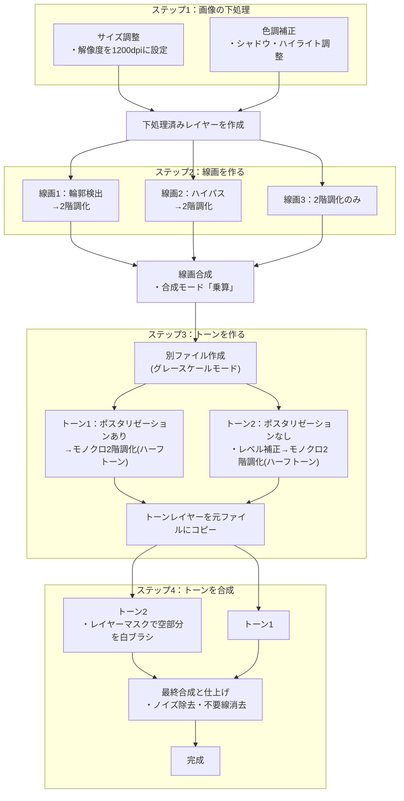

# re5

```mermaid
flowchart TD
  subgraph Step1[ステップ1：画像の下処理]
    A1[サイズ調整<br/>・解像度を1200dpiに設定]  
    A2[色調補正<br/>・シャドウ・ハイライト調整]
  end
  A1 --> A3[下処理済みレイヤーを作成]
  A2 --> A3

  subgraph Step2[ステップ2：線画を作る]
    B1[線画1：輪郭検出<br/>→2階調化]
    B2[線画2：ハイパス<br/>→2階調化]
    B3[線画3：2階調化のみ]
  end
  A3 --> B1
  A3 --> B2
  A3 --> B3
  B1 & B2 & B3 --> B4[線画合成<br/>・合成モード「乗算」]

  subgraph Step3[ステップ3：トーンを作る]
    C1["別ファイル作成<br/>(グレースケールモード)"]
    C1 --> C2["トーン1：ポスタリゼーションあり<br/>→モノクロ2階調化(ハーフトーン)"]
    C1 --> C3["トーン2：ポスタリゼーションなし<br/>・レベル補正→モノクロ2階調化(ハーフトーン)"]
    C2 & C3 --> C4[トーンレイヤーを元ファイルにコピー]
  end
  B4 --> C1

  subgraph Step4[ステップ4：トーンを合成]
    D1[トーン2<br/>・レイヤーマスクで空部分を白ブラシ]
    D2[トーン1]
    D1 & D2 --> D3[最終合成と仕上げ<br/>・ノイズ除去・不要線消去]
    D3 --> D4[完成]
  end
  C4 --> D1
  C4 --> D2

```
