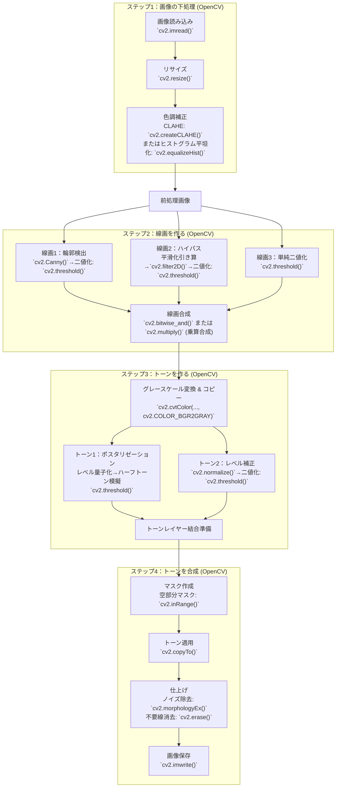

```mermaid
flowchart TD
  subgraph Step1["ステップ1：画像の下処理 (OpenCV)"]
    A0["画像読み込み<br/>`cv2.imread()`"]
    A1["リサイズ<br/>`cv2.resize()`"]
    A2["色調補正<br/>CLAHE: `cv2.createCLAHE()`<br/>またはヒストグラム平坦化: `cv2.equalizeHist()`"]
  end
  A0 --> A1 --> A2 --> A3[前処理画像]

  subgraph Step2["ステップ2：線画を作る (OpenCV)"]
    B1["線画1：輪郭検出<br/>`cv2.Canny()`→二値化: `cv2.threshold()`"]
    B2["線画2：ハイパス<br/>平滑化引き算→`cv2.filter2D()`→二値化: `cv2.threshold()`"]
    B3["線画3：単純二値化<br/>`cv2.threshold()`"]
    B4["線画合成<br/>`cv2.bitwise_and()` または `cv2.multiply()` (乗算合成)"]
  end
  A3 --> B1
  A3 --> B2
  A3 --> B3
  B1 & B2 & B3 --> B4

  subgraph Step3["ステップ3：トーンを作る (OpenCV)"]
    C1["グレースケール変換 & コピー<br/>`cv2.cvtColor(..., cv2.COLOR_BGR2GRAY)`"]
    C2["トーン1：ポスタリゼーション<br/>レベル量子化→ハーフトーン模擬<br/>`cv2.threshold()`"]
    C3["トーン2：レベル補正<br/>`cv2.normalize()`→二値化: `cv2.threshold()`"]
    C4["トーンレイヤー結合準備"]
  end
  B4 --> C1
  C1 --> C2
  C1 --> C3
  C2 & C3 --> C4

  subgraph Step4["ステップ4：トーンを合成 (OpenCV)"]
    D1["マスク作成<br/>空部分マスク: `cv2.inRange()`"]
    D2["トーン適用<br/>`cv2.copyTo()`"]
    D3["仕上げ<br/>ノイズ除去: `cv2.morphologyEx()`<br/>不要線消去: `cv2.erase()`"]
    D4["画像保存<br/>`cv2.imwrite()`"]
  end
  C4 --> D1
  D1 --> D2
  D2 --> D3 --> D4

```
