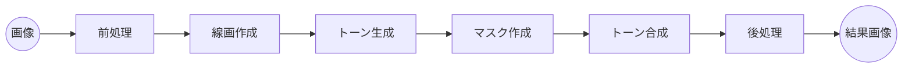

## 詳細設計書: 写真→白黒マンガ背景変換ツール

### 1. ドキュメント情報

- 作成日: 2025-07-24
    
### 2. システム構成

```
CLIアプリケーション
 ├─ main.py
 ├─ modules/
 │   ├─ io.py             # 入出力制御
 │   ├─ preprocess.py     # 下処理（リサイズ・色調補正）
 │   ├─ edge.py           # 線画抽出(Canny/Highpass/Threshold)
 │   ├─ tone.py           # トーン生成・合成
 │   ├─ postprocess.py    # ノイズ除去・仕上げ
 │   ├─ logger.py         # ロギング設定
 │   └─ utils.py          # 共通ユーティリティ
 ├─ tests/
 └─ requirements.txt
```

### 3. 実行フロー

1. 引数解析 (`argparse`)
    
2. 画像読み込み (`io.load_image`)
    
3. 前処理 (`preprocess.resize` → `preprocess.adjust_contrast`)
    
4. 線画抽出（`edge.extract_canny`, `edge.extract_highpass`, `edge.extract_binary`）→ 合成 (`edge.combine_edges`)
    
5. トーン生成 (`tone.generate_posterized`, `tone.generate_levels`)
    
6. トーン合成 (`tone.apply_mask`)
    
7. 後処理 (`postprocess.remove_noise`, `postprocess.cleanup_edges`)
    
8. 画像保存 (`io.save_image`)
    

### 4. モジュール詳細設計

#### 4.1 io.py

- **関数**:
    
    - `load_image(path: str) -> np.ndarray`
        
    - `save_image(img: np.ndarray, path: str, dpi: int)`
        

#### 4.2 preprocess.py

- **関数**:
    
    - `resize(img: np.ndarray, dpi: int) -> np.ndarray`
        
    - `adjust_contrast(img: np.ndarray, method: str, params: dict) -> np.ndarray`
        

#### 4.3 edge.py

- **関数**:
    
    - `extract_canny(img_gray: np.ndarray, threshold1: int, threshold2: int) -> np.ndarray`
        
    - `extract_highpass(img: np.ndarray, kernel_size: int, thresh: int) -> np.ndarray`
        
    - `extract_binary(img_gray: np.ndarray, thresh: int) -> np.ndarray`
        
    - `combine_edges(edges: List[np.ndarray]) -> np.ndarray`
        

#### 4.4 tone.py

- **関数**:
    
    - `generate_posterized(img_gray: np.ndarray, levels: int) -> np.ndarray`
        
    - `generate_levels(img_gray: np.ndarray, level_params: dict) -> np.ndarray`
        
    - `apply_mask(base: np.ndarray, tone: np.ndarray, mask: np.ndarray) -> np.ndarray`
        

#### 4.5 postprocess.py

- **関数**:
    
    - `remove_noise(img: np.ndarray, method: str, kernel: tuple) -> np.ndarray`
        
    - `cleanup_edges(img: np.ndarray, params: dict) -> np.ndarray`
        

#### 4.6 logger.py

- **設定**:
    
    - Logレベル: INFO/DEBUG
        
    - フォーマット: `%(asctime)s [%(levelname)s] %(message)s`
        

#### 4.7 utils.py

- ファイル名・パス操作ユーティリティ
    
- 共通エラーチェック
    

### 5. CLI引数仕様

```
Usage: manga_bg_convert [options] <input> [output]

Options:
  -h, --help            show this help message and exit
  -d DPI, --dpi DPI     出力解像度 (default: 1200)
  --canny1 T1           Canny閾値1 (default: 100)
  --canny2 T2           Canny閾値2 (default: 200)
  --hp-kernel K         ハイパスフィルタ半径 (default: 60)
  --thresh B            二値化閾値 (default: 128)
  --poster-levels N     ポスタリゼーション階調数 (default: 5)
  --mask-thresh M       マスク二値化閾値 (default: 200)
  --batch               フォルダ単位でバッチ処理
```

### 6. データフロー図



### 7. エラーハンドリング

- 入力パス不正: ファイル存在チェック → エラーメッセージ
    
- 処理例外: 各モジュール内で捕捉 & ログ出力 → 処理中断
    

### 8. ロギング

- 各ステップ開始/完了ログ
    
- パラメータ出力
    
- エラー発生時スタックトレース
    

### 9. テスト設計

- ユニットテスト (pytest)
    
    - 各モジュール関数の入出力検証
        
    - 異常系テスト
        
- 結合テスト
    
    - サンプル画像一括変換結果比較
        

### 10. 外部依存

- Python 3.9+
    
- OpenCV 4.x
    
- NumPy 1.21+
    
- SciPy
    
- pytest
